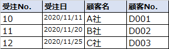

# 正規化とは

以下の説明は、Excel として資料にまとめてあります。

DBの正規化とは   
[DBの正規化とは.xlsx](./docs/DBの正規化とは.xlsx)

 

**データベースの正規化**（normalization）とは、データベースに保存されているデータを使用しやすくするために、ルールに基づいて整理・変形することをいう。

## 正規化のメリット

正規化を行うことで、おもに以下の2点のメリットを得られる。

- データの追加・更新・削除に伴う不整合や喪失が起きるのを防ぐことができる
- メンテナンスの効率性を高めることができる

正規化を正しく行っておけば、データベース運用時に発生する問題を未然に防止することができる。
そのため、システムの運用コストを削減するためにも正規化の必要性が求められる。

この正規化というアイデアはソフトウェア開発をしていると前提知識として扱われる。
そのため、ソフトウェア開発やシステム開発の技術者にとって、正規化は必要最低限の知識となる。

 

## 非正規なデータの状態

まずは正規化されていないデータ、つまり非正規なデータがどのようなものなのかを見ていく。
正規化されていないテーブルは、その中に繰り返しの項目が存在する。

 

### 正規化されていないテーブルの例

今回の例では、事務用品の BtoB 販売（卸売業）を行う Web システムをイメージしてもらいたい。

`事務用品の BtoB 販売（卸売業）`  

`受注内容テーブル`  

上の表「受注テーブル（非正規状態）」は、よくありがちな取引をまとめたテーブルである。
受注の管理番号があり、その顧客名、顧客番号があり、その後には商品名、商品コード、単価、数量の４つの項目が繰り返しになっている。

なぜこのようなテーブルができてしまったかというと、以下の理由などがありそうである。

- 商品コードだけじゃわかりにくいから商品名をいれてみた
- 売れたデータをどんどん入力できるように、商品名から数量までが繰り返されるようにした

 

## 正規化されていないと起こるトラブル

「受注テーブル（非正規状態）」のテーブルは少し見ただけでも、このテーブルが使いにくいものだと感じるかと思う。

例えば、以下のような疑問が浮かぶ。

- 商品名が変更になった時に１つ１つデータを直していくのか
- １社から複数の注文があった場合、このテーブルは右に長くなっていくのか

また、売上の合計がデータベース上のデータと実データでは合わないという場合に、「受注テーブル（非正規状態）」のようなテーブルから間違いを探すのは至難の業となる。

このように、正規化されていないテーブルというのは管理しづらくなるだけでなく、何かトラブルがあった際に対応しづらくなる。

「受注テーブル（非正規状態）」のようにごちゃごちゃとしたつくりのテーブルは、テーブルからデータを１行追加・削除しただけで、エラーが発生してしまうこともある。
無用なトラブルを回避するためにも、正規化を行い、管理しやすく、エラーの発生しないテーブルの構造を目指していく必要がある。

 

## 正規化の方法

データベースのデータを整理・変形していく正規化の段階は次のように分けられる。

この正規化は第３正規化の状態まで対応することが多く、第２正規化でストップするということはあまりない。

### 第１正規化

テーブル中に複数の値をもつようなデータ項目を含まないという条件を満たすように整理する

### 第２正規化

第１正規化後のテーブルに、主キーの一部の項目だけに従属するような項目を含めないように整理する

### 第３正規化

第２正規化後のテーブルに、主キー以外の項目に従属するような項目がなくなるように整理する

 

## 第１正規化

繰り返しの項目が存在する非正規形から、繰り返し部分を取り除いていく。
非正規形の表の横方向に伸びた繰り返し部分を切り離して、重複をなくしていくのが **第１正規化** である。

### 正規化されていないテーブルの例

`受注テーブル（非正規状態）`  

### 第１正規形

例えば、最初の「受注テーブル（非正規状態）」の商品名から数量までの項目の繰り返しを切り離した形は以下のようになる。

`受注テーブル`  

`受注明細テーブル`  

ここでは、「受注テーブル（非正規状態）」の乱雑なテーブルを2つに分割した。1つは受注No.と顧客の情報がまとめられた「受注テーブル」。もう1つが、各注文でどのような商品がどの程度購入されたのかを示す「受注明細テーブル」に分けている。

この第１正規化が完了したテーブルを **「第１正規形」** と呼ぶ。
繰り返しの部分が別になっただけでも、テーブルが見やすくなり、情報の管理しやすいものになったことが感じられるかと思う。

しかし、より管理をしやすくするために、まだまだテーブルに手を加えていける部分がある。

 

## 第２正規化

データをより管理しやすくするために、第１正規形のテーブルで主キーの一部だけに従属している部分を分離する。
この方法を **第２正規化** という。

### 第１正規形

例えば、最初の「受注テーブル（非正規状態）」の商品名から数量までの項目の繰り返しを切り離した形は以下のようになる。

`受注テーブル`  

`受注明細テーブル`  

### 第２正規形

受注明細テーブルを第２正規化し、第２正規形のテーブルにしたものは以下のようになる。

`受注明細テーブル`  

`商品テーブル`  

 

## 第３正規化

第２正規形でデータの冗長性を取り除くことができた。しかし、まだ改良の余地はある。

例えば、顧客の会社名が変わった際に、第１正規形の受注テーブルのように顧客No.と顧客名をすべての注文に記入していた場合は、
いちいちすべての会社名を変えていかなければならない。

これは面倒である上に、ヒューマンエラーで修正漏れなどが出てしまうかもしれない。

### 第２正規形

`受注テーブル`  

`受注明細テーブル`  

`商品テーブル`  

### 第３正規形

この顧客名は主キーである受注No.がわからずとも、顧客コードさえ分かっていれば特定できる情報である。
そのため、受注テーブルから顧客名を以下のように分離させていく。

`受注テーブル`  

`顧客テーブル`  

 

## 最終的なテーブルの姿

ここまでで第３正規化までの作業が終わった。
最初、非正規なデータだったテーブルが、最終的には以下のようなテーブルに整理された。

`受注テーブル`  

`受注明細テーブル`  

`商品テーブル`  

`顧客テーブル`  

このように、第３正規化まで終えたテーブルは、冗長性が排除され、データの整合性を保ちやすくなる。

 

## 応用情報技術者試験での出題

応用情報技術者試験でも正規化は頻出の問題である。
例えば以下のような形式でも出題されている。

### 設問

> 第１、第２、第３正規形とそれらの特徴a～cの組合せのうち、適切なものはどれか。
> 
> **a：** どの非キー属性も、主キーの真部分集合に対して関数従属しない。  
> **b：** どの非キー属性も、主キーに推移的に関数従属しない。  
> **c：** 繰り返し属性が存在しない。

`選択肢`  

第１正規形がどれかはすぐにわかるかと思う。

第１正規化は繰り返しになっている部分を切り離して整理すること。
「c：繰返し属性が存在しない。」が該当する。つまり、第１正規形には c が入る。

しかし、a・bには「真部分集合」や「関数従属」という見慣れぬ用語が含まれている。
これらの用語を見ていきながら、もう少し正規化の理解を深めていきたい。

 

## 真部分集合

真部分集合とは、ある集合が別の集合に完全に含まれている状態をいう。

以下のイメージのように、集合Bは集合Aに完全に含まれており、まったくはみ出していない。
このような状態を真部分集合という。

`真部分集合`  

例えば、「ヒト」は「動物」という集合に属している。この関係も真部分集合といえる。

### 設問を解く

では、先ほどの応用情報技術者試験の「a：どの非キー属性も、主キーの真部分集合に対して関数従属しない。」とはどういうことか？

「主キーの真部分集合」という言葉を言いかえると、「主キーに完全に属している集合」ということになる。

つまり、「主キーの一部に属しているような項目」をどうするのかということに言及している。
この時点で第２正規化の話をしていることが分かると思う。

設問分のこの後に続く「関数従属」についても念のため見ていく。

 

## 関数従属とは

関数従属とは、ある項目が決定すると、自動的に別の項目の値も決まるような関係のこと。
つまり、「この項目の値が分かれば、この項目の値が導き出せる」というような関係を関数従属という。

つまり、a の内容は「主キーの一部が分かれば、判明するような項目がない」状態にすることを言っている。
やはり第２正規化（第２正規形）の話をしていたということが分かる。

### 推移的関数従属とは？

先ほどの応用情報の正規化の設問を解くだけなら、第１正規形が c と分かり、第２正規形が a であるということが分かったので、
答えが選択肢 ウ であることは導き出せた。

しかし、ここはもう少し踏み込んで、「b：どの非キー属性も、主キーに推移的に関数従属しない。」という
設問文に出てきた「推移的に関数従属」という言葉の意味を確かめたい。

この推移的関数従属というのは、「Aが分かればBが分かり、Bが分かればCが分かる」というような関係のことである。

例えば、第３正規化では、顧客名と顧客No.の部分を切り分けた。
これは受注No.が分かれば、顧客No.が分かり、顧客No.が判明すれば、自動的に顧客名が明らかになるからこそ、切り分けることができた。

このような関係にある項目を切り出したのが第３正規化であった。
つまり、これで 「b：どの非キー属性も、主キーに推移的に関数従属しない。」 というのが、
第３正規化（第３正規形）のことを意味していることが分かる。
